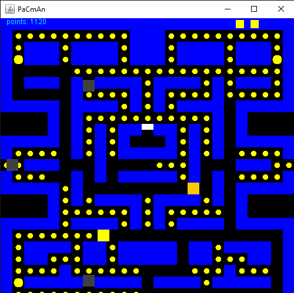
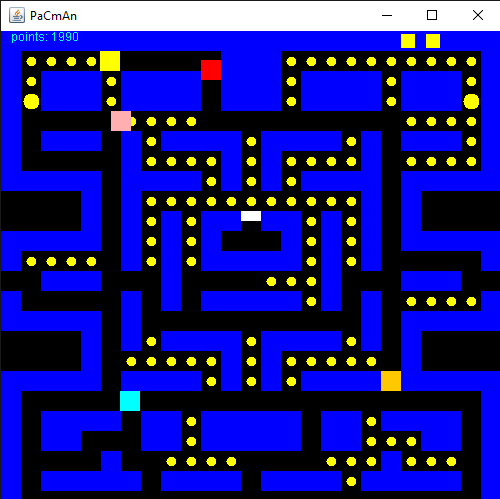

# Pacman
This is knock-off version of pacman. The ghost AI are programmed accordingly, but the scoring system, pace of the game, speed of pacman, etc. were all arbitarily chosen for my experience.

# Rules
- There are 4 ghosts - try to avoid them.\
- There are 2 types of coins - small=points, big=power pellets
- When eating a power pellet, you get a certain amount of time to eat the ghost to earn more points

# Requirements
Java JDK installed.

# Controls
- **arrow keys** (up,left,down,right)
- **tip** don't hold any of the arrow keys until you need to turn. Somtimes pacman has a really hard time turning

